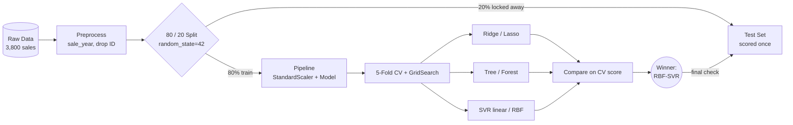
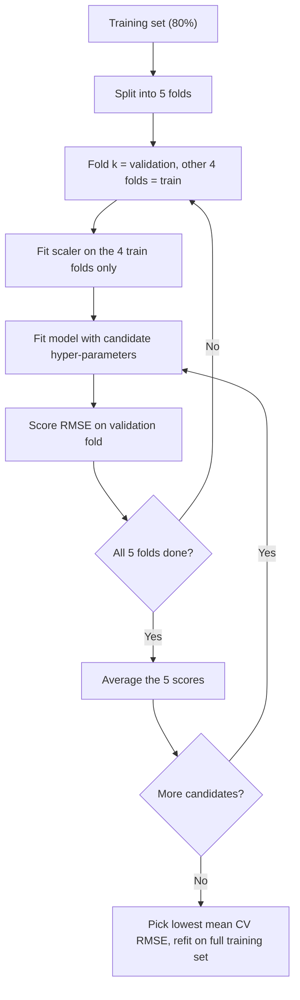
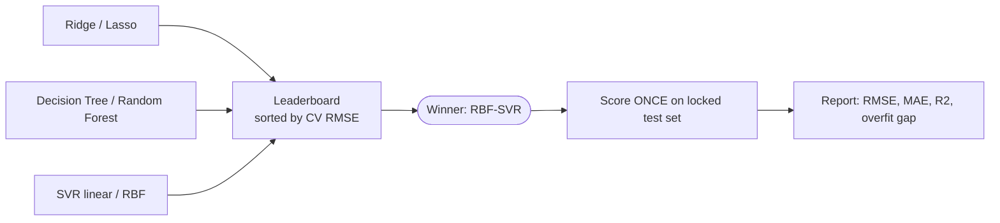

<a id="top"></a>

<div align="center">


<br/>


### 🏡 A robust, leakage-free regression pipeline that predicts house prices **without overfitting**

*Regularization · Cross-Validation · Linear vs Non-Linear Regressors · Honest Model Selection*

<br/>

<!-- ===== ACTION BUTTONS ===== -->
<a href="House_Price_Regression_Pipeline.ipynb"></a>
<a href="https://colab.research.google.com/github/YOUR-USERNAME/YOUR-REPO/blob/main/House_Price_Regression_Pipeline.ipynb"></a>
<a href="Theory_Concepts.pdf"></a>
<a href="house_prices.csv"></a>

<a href="#-3-the-pipeline-at-a-glance"></a>
<a href="#-7-final-leaderboard--diagnosis"></a>
<a href="#-10-design-decisions--faq"></a>
<a href="#-12-reproducibility--how-to-run"></a>

<br/>


</div>

---

## 📑 Table of Contents

1. [Executive Summary (TL;DR)](#-1-executive-summary-tldr)
2. [Problem Statement & Why It Matters](#-2-problem-statement--why-it-matters)
3. [The Pipeline at a Glance](#-3-the-pipeline-at-a-glance)
4. [Dataset Deep-Dive](#-4-dataset-deep-dive)
5. [Theory Primer (Part A)](#-5-theory-primer-part-a)
6. [Experiments, Step by Step (Parts B-G)](#-6-experiments-step-by-step-parts-b-g)
7. [Final Leaderboard & Diagnosis](#-7-final-leaderboard--diagnosis)
8. [What the Model Learned (Interpretation)](#-8-what-the-model-learned-interpretation)
9. [Business Interpretation](#-9-business-interpretation)
10. [Design Decisions & FAQ](#-10-design-decisions--faq)
11. [Limitations & Roadmap](#-11-limitations--roadmap)
12. [Reproducibility & How to Run](#-12-reproducibility--how-to-run)
13. [Repository Structure & Task Map](#-13-repository-structure--task-map)
14. [Glossary](#-14-glossary)

---

## ⚡ 1. Executive Summary (TL;DR)

| Question | Answer |
|---|---|
| **What was built?** | An end-to-end regression pipeline: preprocessing → scaling → tuning with cross-validation → comparison of 6 tuned models across 3 model families. |
| **Which model won?** | **RBF Support Vector Regression** (`C=30`, `gamma=0.003`, `epsilon=0.1`). |
| **How good is it?** | Test **R² = 0.939**, Test **MAE ≈ 1.62 M INR** (≈ 7.8 % of the average price), Test **RMSE ≈ 2.22 M INR**. |
| **Is it overfit?** | No. Train R² 0.938 vs Test R² 0.939, so the gap is about zero. |
| **How much better than a plain linear model?** | RMSE is **11.5 % lower in CV** and **12.6 % lower on the test set** than Ridge/OLS. |
| **What drives price most?** | Built-up area, then location score. Together they account for about 73 % of Random Forest importance. |
| **Was the test set used for choices?** | **No.** Every tuning and selection decision used cross-validation on the training set only. The test set was scored once at the end. |

<p align="right"><a href="#top">⬆ back to top</a></p>

---

## 🎯 2. Problem Statement & Why It Matters

> You are a Machine Learning Engineer at a real-estate analytics company. The existing regression model **overfits** and gives **unstable predictions across datasets**.

### What "overfitting" and "unstable" actually mean here

| Symptom | What is happening | How this project addresses it |
|---|---|---|
| Great on training data, poor on new data | The model memorised noise (high **variance**) | Regularization, tree-depth limits, `C`/`gamma` tuning |
| Score changes a lot between datasets/splits | A single train-test split gives a noisy estimate | K-Fold, Stratified, LOOCV and Time-Series cross-validation |
| Wild coefficients when features are correlated | Multicollinearity inflates coefficient variance | Ridge / Lasso shrinkage |
| Preprocessing leaks validation info | Scaler fitted on all data before splitting | Scaler placed **inside** the `Pipeline` |

### Project goals

- ✅ Apply **regularization techniques** (Ridge L2, Lasso L1)
- ✅ Use **proper cross-validation strategies** (4 different schemes, compared)
- ✅ Compare **linear and non-linear** regression models (Ridge, Lasso, Decision Tree, Random Forest, SVR linear/RBF)
- ✅ Select the **best model on validation performance**, and prove it generalises on unseen data

<p align="right"><a href="#top">⬆ back to top</a></p>

---

## 🧭 3. The Pipeline at a Glance

<div align="center">

</div>



### 3.1 Model-wise pipelines

<div align="center">

</div>

| Family | Needs scaling? | Tuned knobs | Why |
|---|:-:|---|---|
| 🔵 Regularized linear | ✅ Yes | `alpha` | The penalty depends on coefficient size, which depends on feature scale. |
| 🟢 Tree-based | ❌ No | `max_depth`, `min_samples_leaf`, `max_features` | Splits depend only on value ordering. |
| 🟣 SVR | ✅ Yes (X **and** y) | `C`, `gamma`, `epsilon` | Distances and the ε-tube are scale-sensitive. |

### 3.2 Cross-validation workflow (inside every tuning step)



### 3.3 Model selection and final evaluation



### 3.4 Four design principles that make it "robust"

| # | Principle | Why it matters |
|:-:|---|---|
| 1 | **No leakage** | The scaler is fitted on training folds only, never on validation or test rows. |
| 2 | **Test set is sacred** | 20 % of rows are locked away and scored exactly once. |
| 3 | **Select on CV, confirm on test** | The winner is picked by cross-validated RMSE. The test score only *confirms* it. |
| 4 | **Complexity is always controlled** | Every flexible model has a tuned "brake": `alpha`, `max_depth`, `min_samples_leaf`, `C`, `gamma`. |

<details>
<summary><b>🧩 Show the core pipeline code</b></summary>

```python
from sklearn.pipeline import Pipeline
from sklearn.preprocessing import StandardScaler
from sklearn.model_selection import KFold, GridSearchCV
from sklearn.linear_model import Ridge

def scaled(model):
    # scaler lives INSIDE the pipeline -> fitted on training folds only
    return Pipeline([("scale", StandardScaler()), ("model", model)])

kf = KFold(n_splits=5, shuffle=True, random_state=42)

ridge_gs = GridSearchCV(
    scaled(Ridge()),
    {"model__alpha": np.logspace(-3, 4, 40)},
    cv=kf, scoring="neg_root_mean_squared_error",
).fit(X_train, y_train)
```
</details>

<p align="right"><a href="#top">⬆ back to top</a></p>

---

## 📦 4. Dataset Deep-Dive

**3,800 property sales** from **2010 to 2023**, with **no missing values and no duplicate IDs**.

### 4.1 Feature dictionary

| Feature | Group | Meaning | Correlation with price |
|---|---|---|--:|
| `area_sqft` | Size | Built-up area in square feet | **+0.850** |
| `bedrooms` | Structure | Number of bedrooms | +0.726 |
| `bathrooms` | Structure | Number of bathrooms | +0.610 |
| `location_score` | Location | Numeric neighbourhood quality indicator (1-10) | +0.429 |
| `distance_city_km` | Location | Distance from the city centre | -0.281 |
| `near_school` | Location | 1 if a school is nearby | -0.012 |
| `near_metro` | Location | 1 if a metro station is nearby | -0.025 |
| `crime_rate_index` | Location | Local crime index | -0.052 |
| `property_age` | Age | Age of the property in years | -0.079 |
| `sale_year` | Time | Year extracted from `sale_date` | +0.032 |
| ~~`property_id`~~ | ID | Row identifier, **dropped** (no predictive meaning) | -0.010 |
| **`house_price_inr`** | **Target** | **Sale price in INR** | - |

### 4.2 Target variable

| Statistic | Value (INR) |
|---|--:|
| Mean | 20,719,397 |
| Median | 19,891,802 |
| Std. deviation | 8,707,465 |
| Min / Max | 1,506,126 / 59,303,146 |
| Skewness | 0.58 (moderately right-skewed) |

<div align="center">

</div>

### 4.3 What the EDA tells us

- **Size dominates.** `area_sqft` alone has r = 0.85 with price.
- **Multicollinearity exists.** `area_sqft`↔`bedrooms` r = 0.84 and `bedrooms`↔`bathrooms` r = 0.83. Bigger houses simply have more rooms. This is precisely where **Ridge** helps: it spreads weight across correlated features instead of letting coefficients explode.
- **Some features look useless on their own.** `near_school`, `near_metro` and `sale_year` have almost zero correlation with price. This is a natural test for **Lasso**, which can switch such features off.
- **Prices barely drift with time** (`sale_year` r = 0.03), which explains why Time-Series CV later agrees with random CV.

### 4.4 Preprocessing choices

| Step | Decision | Reason |
|---|---|---|
| Identifier | Drop `property_id` | Pure ID, would add noise. |
| Date | `sale_date` → `sale_year` | Models need numbers, and it is also the ordering key for Time-Series CV. |
| Missing values | None to handle | Verified: 0 missing. |
| Scaling | `StandardScaler` in the pipeline | Needed by Ridge, Lasso and SVR. Trees do not need it. |
| Target for SVR | Also standardised (`TransformedTargetRegressor`) | Prices are about 10⁷; without this the epsilon-tube and `C` are meaningless. |
| Split | 80 / 20, `random_state=42` | 3,040 train rows, 760 test rows. |

<p align="right"><a href="#top">⬆ back to top</a></p>

---

## 🧠 5. Theory Primer (Part A)

*Short, exam-ready answers. A longer version lives in [`Theory_Concepts.pdf`](Theory_Concepts.pdf).*

### 5.1 Regularization

Regularization adds a **penalty on coefficient size** to the loss, so the model is discouraged from chasing noise.

```
Loss = Σ (y − ŷ)²  +  λ · Penalty(w)
```

- λ = 0 → plain least squares (can overfit).
- λ very large → coefficients squeezed toward zero (underfits).
- The best λ (`alpha` in scikit-learn) sits in the middle and is found by cross-validation.

### 5.2 Ridge (L2) vs Lasso (L1)

| Aspect | 🔵 Ridge (L2) | 🟠 Lasso (L1) |
|---|---|---|
| Penalty | `α · Σ wⱼ²` | `α · Σ \|wⱼ\|` |
| Effect on coefficients | Shrinks smoothly, rarely to exactly 0 | Can shrink to **exactly 0** |
| Feature selection | ❌ No | ✅ Yes (built-in) |
| Correlated features | Shares weight among them | Tends to pick one, drop others |
| Best when | Many useful, correlated features | Many irrelevant features, need sparsity |

### 5.3 Cross-validation (CV)

CV repeatedly splits the **training** data into train/validation parts and averages the validation scores. It gives a lower-variance estimate of generalisation than a single split and lets us tune and compare models without touching the test set.

| Technique | How it works | Best for | Drawback |
|---|---|---|---|
| **K-Fold** | K equal folds, each is validation once | General default | Folds may be unrepresentative |
| **Stratified K-Fold** | Keeps the class / target distribution equal in every fold | Imbalanced or skewed targets | Regression target must be *binned* |
| **Leave-One-Out** | K = N, one row validates at a time | Tiny datasets | N fits, high variance, slow |
| **Time Series Split** | Expanding window: train on past, validate on future | Time-ordered data | Early folds have little training data |

### 5.4 Why tree-based models ignore feature scaling

A tree only asks *"is feature ≤ threshold?"*. That depends on the **ordering** of values, not their magnitude. Any monotonic rescaling leaves the best split unchanged. In contrast, Ridge, Lasso and SVR rely on penalties or distances, so scale directly affects them.

### 5.5 Support Vector Regression in one minute

SVR fits a function that stays inside an **ε-tube** around the data. Errors inside the tube are free. Only points outside it (the *support vectors*) shape the model.

| Hyper-parameter | Controls | Too high | Too low |
|---|---|---|---|
| `C` | Penalty for points outside the tube | Overfits | Underfits |
| `epsilon` | Width of the tube | Too smooth | Chases noise |
| `gamma` (RBF) | Reach of one training point | Wiggly, overfits | Almost linear |

```
K_rbf(x, x′) = exp( −γ · ‖x − x′‖² )
```

<p align="right"><a href="#top">⬆ back to top</a></p>

---

## 🔬 6. Experiments, Step by Step (Parts B-G)

### 🧪 Part C: Regularized linear models (Tasks 9-12)

**Setup:** 40 log-spaced `alpha` values per model, 5-fold CV, scoring on RMSE.

| Model | Best `alpha` | CV RMSE | Test RMSE | Test R² |
|---|--:|--:|--:|--:|
| OLS (no penalty) | - | 2,495,141 | 2,539,148 | 0.9199 |
| **Ridge** | 1.70 | 2,495,117 | 2,539,566 | 0.9199 |
| **Lasso** | 10,000 | 2,494,929 | 2,541,580 | 0.9198 |

> ℹ️ Lasso's `alpha` looks large because the target is in INR (~10⁷). It is small *relative to the loss scale*.

<div align="center">

</div>

**How to read this chart:** as `alpha` grows, training error rises (the model is being restrained). Validation error dips to a minimum, then rises again as the model underfits. The dashed line marks the CV-chosen `alpha`.

#### Coefficient behaviour (standardised, INR millions per +1 std)

| Feature | OLS | Ridge | Lasso |
|---|--:|--:|--:|
| `area_sqft` | 6.956 | 6.943 | 6.949 |
| `location_score` | 3.681 | 3.678 | 3.676 |
| `property_age` | -0.650 | -0.650 | -0.641 |
| `sale_year` | 0.301 | 0.301 | 0.291 |
| `bedrooms` | 0.290 | 0.300 | 0.290 |
| `bathrooms` | 0.272 | 0.272 | 0.267 |
| `crime_rate_index` | -0.141 | -0.141 | -0.131 |
| `near_metro` | 0.053 | 0.052 | 0.043 |
| `distance_city_km` | -0.027 | -0.029 | -0.020 |
| `near_school` | 0.015 | 0.016 | **0.005** |

<div align="center">


</div>

#### 🔎 Why did regularization barely change accuracy?

This is the most important *honest* finding of Part C:

1. **Lots of data, few features.** 3,040 training rows vs 10 features means OLS has low variance to begin with.
2. **Mild multicollinearity.** Correlated features exist, but not severely enough to destabilise coefficients.
3. **Remaining error is bias, not variance.** The linear models plateau at R² ≈ 0.92 because the true price function has *non-linear* structure. Shrinking coefficients cannot fix that.
4. **Lasso's path still teaches something.** As `alpha` grows, the small-effect features hit zero first, while `area_sqft` and `location_score` survive longest (the path chart shows `area_sqft` only reaching zero at very large alpha). At the CV-optimal alpha, `near_school` is shrunk the most in relative terms (0.015 → 0.005). That is a data-driven ranking of feature usefulness.

> 💡 **Take-away:** regularization is a *safety net against overfitting*, and here it confirms the baseline was not overfit. The accuracy gain had to come from a better model family.

---

### 🔁 Part D: Cross-validation strategies (Tasks 13-14)

The tuned Ridge and Lasso were evaluated under four schemes:

| Model | Strategy | RMSE (INR) | R² | R² std across folds |
|---|---|--:|--:|--:|
| Ridge | K-Fold (5) | 2,495,117 | 0.9163 | 0.0049 |
| Ridge | Stratified K-Fold (5) | 2,492,475 | 0.9167 | **0.0015** |
| Ridge | Leave-One-Out | 2,492,292 | 0.9167 | n/a (3,040 folds) |
| Ridge | Time Series Split (5) | 2,490,252 | 0.9166 | 0.0058 |
| Lasso | K-Fold (5) | 2,494,929 | 0.9163 | 0.0049 |
| Lasso | Stratified K-Fold (5) | 2,492,011 | 0.9167 | **0.0015** |
| Lasso | Leave-One-Out | 2,492,465 | 0.9167 | n/a |
| Lasso | Time Series Split (5) | 2,488,832 | 0.9167 | 0.0057 |

<div align="center">


</div>

#### 🔎 Reading the results

- **The level is the same everywhere** (≈ 2.49 M RMSE, R² ≈ 0.917). This is good news: the performance estimate is *trustworthy* and not an artefact of one lucky split.
- **The spread differs.** Stratified K-Fold is about 3× more stable (std 0.0015) because every fold has the same price distribution.
- **LOOCV** gives one nearly unbiased pooled number, but costs 3,040 model fits, for essentially the same answer.
- **Time Series Split** is noisier because early folds train on little data. It is the *right* scheme if the model will predict **future** sales. Here it agrees with the random splits because prices hardly drift over time.

<details>
<summary><b>🧩 How stratification was done for a continuous target</b></summary>

```python
# Bin the continuous target into 10 quantile bins, then stratify on the bins
y_bins = pd.qcut(y_train, q=10, labels=False)
skf = StratifiedKFold(5, shuffle=True, random_state=42)
folds = list(skf.split(X_train, y_bins))          # pass as explicit folds
cross_validate(model, X_train, y_train, cv=folds, ...)
```

Time-series CV was run on the training rows **sorted by `sale_date`**, so each fold trains on the past and validates on the future.
</details>

---

### 🌳 Part E: Tree-based models (Tasks 15-18)

**Decision Tree.** Complexity was controlled with `max_depth`, `min_samples_leaf` and `min_samples_split`.

<div align="center">

</div>

**The overfitting signature (right chart):** with `min_samples_leaf=1`, training R² keeps climbing as depth increases while CV R² peaks and then *falls*. The tree is memorising individual houses.

| Model | Best hyper-parameters | Train R² | CV R² | Test R² |
|---|---|--:|--:|--:|
| Decision Tree | `max_depth=8`, `min_samples_leaf=20`, `min_samples_split=2` | 0.9296 | 0.8994 | 0.9071 |
| Random Forest | `n_estimators=150`, `max_depth=10`, `max_features=0.5`, `min_samples_leaf=1` | 0.9752 | 0.9246 | 0.9276 |

**Single tree vs ensemble:** the forest cuts test RMSE from 2.73 M to 2.42 M (**-11.7 %**). Averaging many decorrelated trees removes most of a single tree's variance.

<div align="center">

</div>

> ⚠️ **Honest caveat on the forest's "gap".** Its train R² (0.975) is inflated because each tree has seen most training rows. The proper comparison is CV/test: **0.925 / 0.928**. Still, it has the largest train-test gap of all models, a sign of residual variance.

---

### 📐 Part F: Support Vector Regression (Tasks 19-21)

| Kernel | Best hyper-parameters | CV RMSE | Test R² |
|---|---|--:|--:|
| Linear | `C=10`, `epsilon=0.1` | 2,503,306 | 0.9185 |
| **RBF** | **`C=30`, `gamma=0.003`, `epsilon=0.1`** | **2,207,495** | **0.9388** |

<div align="center">

</div>

**Why the RBF kernel wins:** the linear-kernel SVR behaves like Ridge (R² ≈ 0.918), confirming the linear ceiling. The RBF kernel bends the fit around non-linear interactions, and a **small `gamma`** keeps that bend smooth, so it improves accuracy without overfitting.

<details>
<summary><b>🧩 Why SVR needs the target scaled too</b></summary>

```python
def svr_pipe(**kw):
    # X is scaled by the pipeline, y by TransformedTargetRegressor.
    return TransformedTargetRegressor(
        regressor=scaled(SVR(**kw)),
        transformer=StandardScaler(),
    )
```

`epsilon` is measured in target units. With prices around 10⁷, an `epsilon` of 0.1 would be meaningless. After standardising `y`, `epsilon=0.1` means "0.1 standard deviations of price".
</details>

> ⚠️ The chosen RBF setting (`C=30`, `gamma=0.003`) lies on the **edge** of the searched grid, so a wider search could squeeze out a little more.

<p align="right"><a href="#top">⬆ back to top</a></p>

---

## 🏆 7. Final Leaderboard & Diagnosis

### 7.1 Full comparison (Part G, Tasks 22-24)

| 🏅 | Model | Family | Train RMSE | CV RMSE | Test RMSE | Test MAE | CV R² | Test R² |
|:-:|---|---|--:|--:|--:|--:|--:|--:|
| 🥇 | **SVR (RBF)** | SVR | 2,153,650 | **2,207,495** | **2,219,970** | **1,617,707** | **0.9345** | **0.9388** |
| 🥈 | Random Forest | Tree | 1,359,009 | 2,368,095 | 2,415,113 | 1,765,944 | 0.9246 | 0.9276 |
| 🥉 | Lasso (L1) | Reg. Linear | 2,482,603 | 2,494,929 | 2,541,580 | 1,945,928 | 0.9163 | 0.9198 |
| 4 | Ridge (L2) | Reg. Linear | 2,482,466 | 2,495,117 | 2,539,566 | 1,944,671 | 0.9163 | 0.9199 |
| 5 | SVR (linear) | SVR | 2,493,818 | 2,503,306 | 2,561,257 | 1,938,089 | 0.9158 | 0.9185 |
| 6 | Decision Tree | Tree | 2,291,158 | 2,733,119 | 2,734,877 | 2,022,269 | 0.8994 | 0.9071 |

<div align="center">

</div>

### 7.2 Overfitting / underfitting diagnosis (Task 24)

| Model | Train R² | Test R² | Gap | Verdict |
|---|--:|--:|--:|---|
| Ridge | 0.9174 | 0.9199 | -0.0025 | 🟡 **Mild underfit** (bias-limited, no overfit) |
| Lasso | 0.9174 | 0.9198 | -0.0024 | 🟡 **Mild underfit** |
| SVR (linear) | 0.9166 | 0.9185 | -0.0019 | 🟡 **Mild underfit** |
| Decision Tree | 0.9296 | 0.9071 | +0.0225 | 🔴 **Overfits** and is also the weakest overall |
| Random Forest | 0.9752 | 0.9276 | +0.0477 | 🔴 **Overfits** (largest gap) |
| **SVR (RBF)** | 0.9378 | 0.9388 | **-0.0010** | 🟢 **Well balanced** |

**Rule of thumb used:** high error on train *and* validation ⇒ underfitting (bias). Low train error but clearly higher validation/test error ⇒ overfitting (variance). Both small ⇒ balanced.

### 7.3 Learning curves (do the models need more data?)

<div align="center">

</div>

| Model | What the curves show | Meaning |
|---|---|---|
| Ridge | Train and CV converge quickly at ≈ 0.92 | High bias, low variance. More data will not help. |
| Random Forest | Big, persistent gap that narrows slowly | High variance. More data would help. |
| RBF-SVR | Curves converge at a higher plateau (≈ 0.935) | Best bias-variance balance. |

### 7.4 Predictions vs reality

<div align="center">

</div>

Points hug the red diagonal and the residuals are centred on zero, so there is no large systematic bias. One weakness is visible, though: the residuals form a **funnel**. Errors are small for cheap homes and grow for expensive ones (**heteroscedasticity**), and the model tends to under-predict a few of the highest-priced properties. In practice, error is larger in absolute INR for premium homes. A log-transformed target (see the roadmap) is the natural fix.

### 7.5 What does the error mean in business terms?

<div align="center">

</div>

<p align="right"><a href="#top">⬆ back to top</a></p>

---

## 🔍 8. What the Model Learned (Interpretation)

### 8.1 Three views of feature importance agree

| Feature | Linear effect (INR M per +1 std) | Random Forest importance | Story |
|---|--:|--:|---|
| `area_sqft` | **+6.95** | **54.3 %** | The #1 price driver in every view. |
| `location_score` | **+3.68** | **18.2 %** | The clear #2 driver. |
| `bedrooms` | +0.29 | 15.7 % | Mostly captures *size* (r = 0.84 with area). The forest splits credit between them. |
| `property_age` | -0.65 | 1.3 % | Older = cheaper, modest effect. |
| `crime_rate_index` | -0.14 | 1.0 % | Small negative effect. |
| `near_metro`, `near_school` | ≈ 0 | ≈ 0.1 % each | No independent effect once location is accounted for. |

> 📏 **Reading a standardised coefficient:** +6.95 M means *"a house one standard deviation larger (≈ 583 sq ft) is worth about 6.95 M INR more, holding everything else equal"*.

### 8.2 Why non-linear models gained ~2 R² points

The linear models leave about 8 % of variance unexplained. The RBF-SVR recovers roughly a quarter of that, which suggests real but moderate **interactions** (for example, an extra square foot may be worth more in a high-scoring location).

<p align="right"><a href="#top">⬆ back to top</a></p>

---

## 💼 9. Business Interpretation

| Insight | Implication |
|---|---|
| Typical error ≈ **1.6 M INR (MAE)**, about **7.8 %** of the average price | Suitable for **screening, benchmarking and portfolio analytics**. |
| Typical large-error scale ≈ 2.2 M INR (RMSE), about 10.7 % | Individual predictions can still be off by more than 10 %; expect an error band, not a point. Errors are larger for premium homes. |
| Area and location drive value | Pricing tools and dashboards should foreground these two inputs. |
| Proximity flags (`near_school`, `near_metro`) add little | Do not over-weight them in marketing or valuation narratives. |
| Time barely moves prices in this data | The model is stable across years, but should still be monitored for market shifts. |

**Recommended deployment:**
1. Ship the tuned **RBF-SVR** pipeline (scaler + model + target transform are bundled, so inputs need no manual preprocessing).
2. Prefer the **Random Forest** if per-feature importances must be reported to stakeholders.
3. **Retrain periodically** and monitor with time-based validation.
4. Treat outputs as **decision support**, not a replacement for a formal valuation.

<p align="right"><a href="#top">⬆ back to top</a></p>

---

## 🤔 10. Design Decisions & FAQ

<details>
<summary><b>Why is the winner chosen by cross-validation and not by test score?</b></summary>

If you pick the model with the best test score, the test set stops being an unbiased estimate, because you have effectively tuned on it. Here CV chose RBF-SVR, and the untouched test set then *independently confirmed* it (R² 0.9388 vs CV 0.9345).
</details>

<details>
<summary><b>Why RMSE for tuning, and not R²?</b></summary>

RMSE is in the same units as the target (INR), so it is directly interpretable and penalises large mistakes, which matter most in pricing. R² is reported alongside it for a scale-free view.
</details>

<details>
<summary><b>Why is Leave-One-Out only run on Ridge and Lasso?</b></summary>

LOOCV needs one fit per training row (3,040). That is instant for linear models but very expensive for Random Forest or SVR. The CV comparison in Part D therefore focuses on the two regularized linear models, while all six models are tuned with 5-fold CV.
</details>

<details>
<summary><b>Why does Lasso keep all 10 features?</b></summary>

At its CV-optimal `alpha`, the penalty is gentle, and every feature carries at least a little signal, so none is forced to exactly zero. The coefficient *path* plot shows what happens with stronger penalties: weak features go first.
</details>

<details>
<summary><b>Why not log-transform the target?</b></summary>

Skewness is only 0.58, which is mild, and keeping the raw INR scale keeps every metric directly interpretable. A log-target is listed under future work.
</details>

<details>
<summary><b>Why is <code>sale_year</code> included but not the full date?</b></summary>

A raw timestamp is not usable by the models, and year is a clean numeric proxy for market timing. It is also the ordering key for the Time-Series split.
</details>

<details>
<summary><b>Why is the Random Forest's train R² so high?</b></summary>

Each tree is trained on a bootstrap sample of the training data, so scoring the forest on the same rows is optimistic. That is why the CV and test numbers, not the train number, are used for comparison.
</details>

<p align="right"><a href="#top">⬆ back to top</a></p>

---

## 🚧 11. Limitations & Roadmap

**Known limitations**

- 🔸 The best SVR sits at the edge of the searched (`gamma`, `C`) grid.
- 🔸 Only one random train/test split (seed 42) is reported. A repeated-split study would give confidence intervals.
- 🔸 The dataset has no explicit city or micro-market identifier, so "unseen datasets" is approximated by CV rather than a truly separate market.
- 🔸 Residuals widen for expensive homes (heteroscedasticity), so absolute errors are larger for premium properties.
- 🔸 Leave-One-Out was run only for the two linear models (cost).

**Roadmap**

- [ ] Wider / randomised search for SVR (`C`, `gamma`)
- [ ] Gradient boosting (XGBoost / LightGBM / HistGradientBoosting)
- [ ] Log-transformed target
- [ ] Interaction features (`area × location_score`)
- [ ] Prediction intervals (quantile regression or conformal prediction)
- [ ] Nested cross-validation for an even less biased estimate
- [ ] Serve the pipeline behind a small API / Streamlit demo

<p align="right"><a href="#top">⬆ back to top</a></p>

---

## ⚙️ 12. Reproducibility & How to Run

| Item | Value |
|---|---|
| Random seed | `42` everywhere (split, CV shuffling, forests, trees) |
| Split | 80 / 20 → 3,040 train, 760 test |
| Default CV | 5-fold, shuffled |
| Main metric | RMSE (also MSE, MAE, R²) |
| Runtime | A few minutes on a single CPU core |

```bash
# 1. Clone
git clone <your-repo-url>
cd house-price-regression

# 2. Install
pip install numpy pandas scikit-learn matplotlib seaborn jupyter

# 3. Run
jupyter notebook House_Price_Regression_Pipeline.ipynb
```

> The notebook expects `house_prices.csv` in the same folder.

> 🔧 **Before publishing:** replace `YOUR-USERNAME/YOUR-REPO` in the **Run in Colab** button (top of this file) and `<your-repo-url>` in the clone command above with your real GitHub address. The Notebook, Theory PDF and Dataset buttons use relative links and work automatically once the files are in the repo.

<p align="right"><a href="#top">⬆ back to top</a></p>

---

## 🗂️ 13. Repository Structure & Task Map

```
📦 house-price-regression
 ┣ 📓 House_Price_Regression_Pipeline.ipynb   # full implementation (Parts A-H, with outputs)
 ┣ 📄 Theory_Concepts.pdf                     # theory definitions
 ┣ 📊 house_prices.csv                        # dataset (3,800 rows)
 ┣ 🖼️ images/                                 # all charts used in this README
 ┗ 📝 README.md
```

### Where each assignment task lives

| Part | Tasks | Topic | README section |
|:-:|:-:|---|---|
| A | 1-5 | Theory | [§5](#-5-theory-primer-part-a) |
| B | 6-8 | Features, split, preprocessing | [§4](#-4-dataset-deep-dive) |
| C | 9-12 | Ridge & Lasso, tuning, comparison | [§6 Part C](#-part-c-regularized-linear-models-tasks-9-12) |
| D | 13-14 | Cross-validation strategies | [§6 Part D](#-part-d-cross-validation-strategies-tasks-13-14) |
| E | 15-18 | Decision Tree & Random Forest | [§6 Part E](#-part-e-tree-based-models-tasks-15-18) |
| F | 19-21 | Support Vector Regression | [§6 Part F](#-part-f-support-vector-regression-tasks-19-21) |
| G | 22-24 | Metrics, comparison, over/under-fit | [§7](#-7-final-leaderboard--diagnosis) |
| H | 25-26 | Final report & submission | [§8-9](#-8-what-the-model-learned-interpretation), notebook |

<p align="right"><a href="#top">⬆ back to top</a></p>

---

## 📖 14. Glossary

| Term | Plain-English meaning |
|---|---|
| **Bias** | Error from a model being too simple to capture the pattern. |
| **Variance** | Error from a model being too sensitive to the training sample. |
| **Overfitting** | Great on training data, worse on new data. |
| **Underfitting** | Poor on both training and new data. |
| **Regularization** | A penalty that keeps a model simple. |
| **Hyper-parameter** | A setting chosen *before* training (`alpha`, `max_depth`, `C`). |
| **Data leakage** | Information from validation/test data sneaking into training. |
| **Multicollinearity** | Predictors that are strongly correlated with each other. |
| **RMSE** | Root of the average squared error, in target units. |
| **MAE** | Average absolute error, in target units. |
| **R²** | Share of price variance explained (1 = perfect, 0 = predicting the mean). |
| **Support vector** | A training point outside the ε-tube that shapes an SVR. |
| **Kernel** | A function that lets SVR fit curved (non-linear) relationships. |

---

<div align="center">

### ⭐ If this project helped you, consider giving it a star!

*Built with scikit-learn · Evaluated honestly · Documented in depth*

</div>
